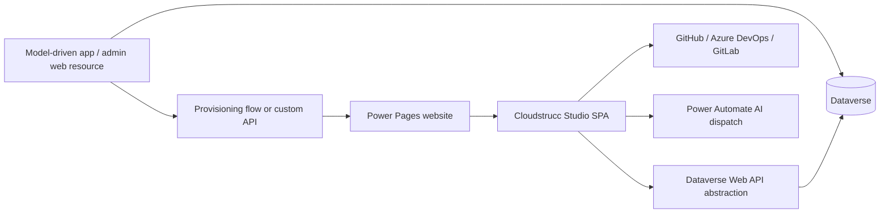
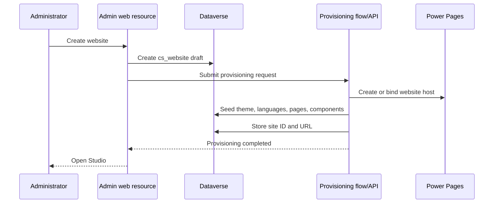

# Architecture

## Logical architecture

## Layers

1. **Dataverse metadata layer**: custom Cloudstrucc tables represent websites, pages, component definitions, component instances, themes, data sources, permissions, localization, and deployments.
2. **Admin layer**: an HTML web resource embedded in a model-driven app. It provisions sites and manages environment-level configuration.
3. **Studio layer**: a Svelte/TypeScript SPA compiled to static web resources and hosted from the Power Pages site.
4. **Runtime layer**: the generated site consumes Dataverse through the Power Pages Web API and a governed query abstraction.
5. **Automation layer**: Power Automate handles AI prompts, approvals, site-provisioning orchestration, and audit logging.
6. **ALM layer**: PAC CLI, solutions, deployment settings, source control, and environment-specific values.

## Provisioning sequence

